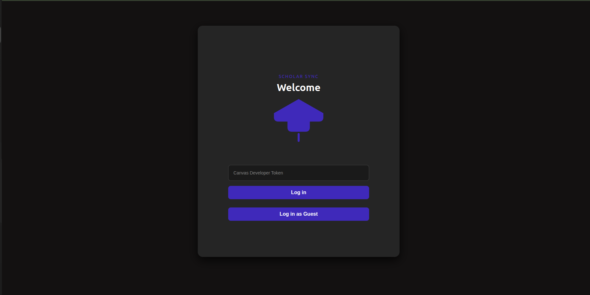
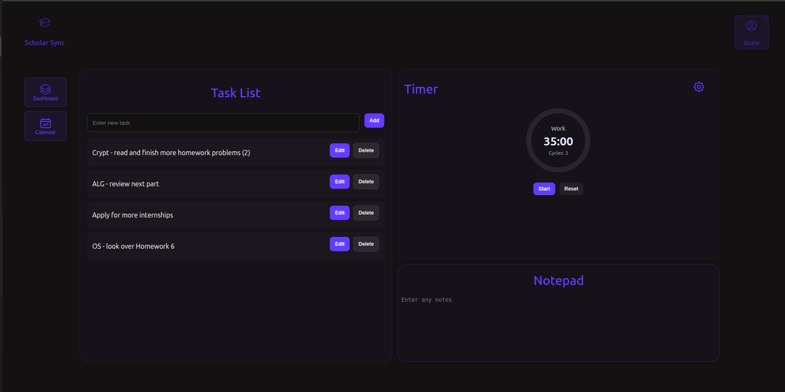
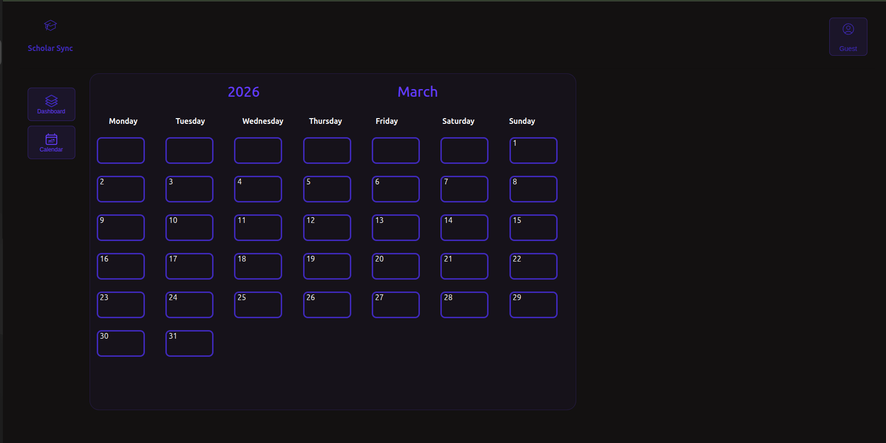

# Study Productivity App

A full-stack study productivity application integrating Canvas LMS data with a custom task and calendar management system.

---

## Overview

This app centralizes academic data (courses, assignments, grades, calendar events) and combines it with a custom event tracker to reduce cognitive overhead and make deadlines impossible to ignore.

**Frontend:** React  
**Backend:** Spring Boot (Spring Web, Spring Data JPA)  
**Database:** PostgreSQL  
**Authentication:** Token-based (Canvas API + custom auth context)

---

## Features

- Fetch Canvas courses
- Retrieve assignments with due dates
- Display grades
- View Canvas calendar events
- Create, edit, and delete custom events
- Protected routes using authentication context
- RESTful backend architecture
- PostgreSQL persistence for custom data

---

## Architecture

### Frontend (React)

- React Router for routing
- Context API for authentication state
- Component-based dashboard structure
- Dev token sent via request headers
- Axios/Fetch for backend communication

### Backend (Spring Boot)

- Layered architecture: **Controller → Service → Client**
- DTOs for response shaping
- REST endpoints returning JSON
- Canvas API integration
- Spring Data JPA for persistence

---

## Key Endpoints

| Endpoint        | Method | Description                              |
|---------------|--------|------------------------------------------|
| `/courses`     | GET    | Returns list of Canvas courses           |
| `/assignments` | GET    | Returns assignments with due dates       |
| `/grades`      | GET    | Returns course grades                    |
| `/calendar`    | GET    | Returns Canvas calendar events           |
| `/events`      | CRUD   | Manage custom user-created events        |

---

## Security Notes

- Dev token sent via request headers (not request body)
- Frontend route protection implemented
- DTO separation prevents overexposing data

---

## Future Improvements

- Full OAuth flow (replace dev token)
- Role-based access control
- UI performance optimization
- Production deployment with HTTPS
- CI/CD pipeline integration
- Improved error handling and logging

---

## Purpose

Designed to simplify academic workload visibility and build full-stack engineering skills through real-world API integration and layered backend architecture.

