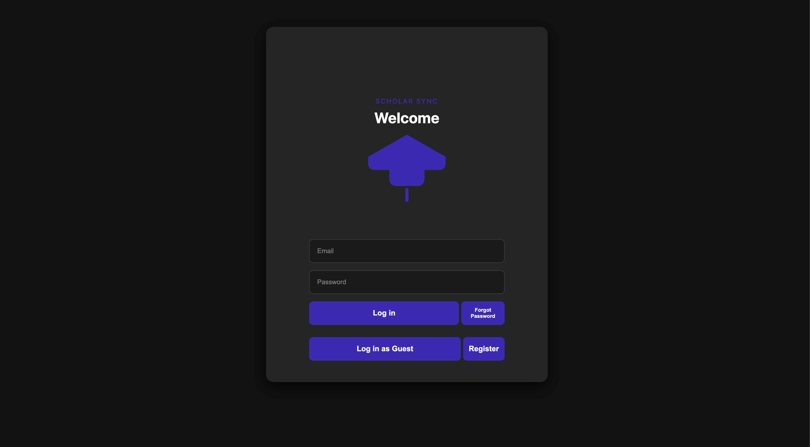
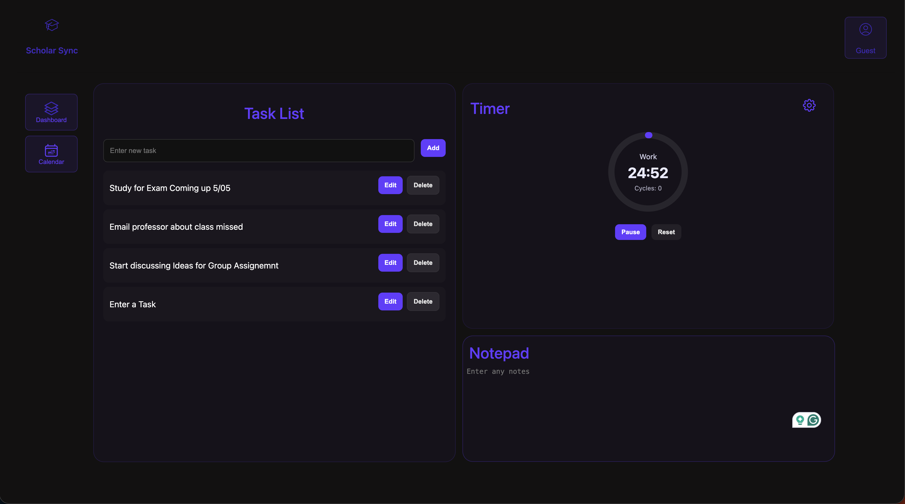
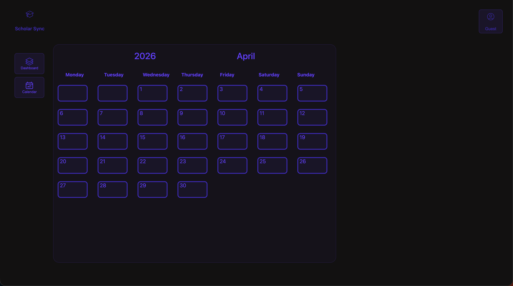

# Study Productivity App

A full-stack study productivity application for managing study tasks, notes, timers, calendar planning, and Canvas calendar events.

---

## Overview

This app centralizes study planning tools with saved user tasks, notepad content, calendar views, and Canvas calendar events imported from a calendar link.

**Frontend:** React  
**Backend:** Spring Boot (Spring Web, Spring Data JPA)  
**Database:** PostgreSQL  
**Authentication:** JWT-based app login with React auth context

---

## Getting started

### What you need

| Tool | Purpose |
|------|---------|
| [Node.js](https://nodejs.org/) (LTS) and **npm** | Install and run the React frontend |
| **Java 21** | Compile and run the Spring Boot backend |
| **Maven** (optional) | The backend includes the Maven Wrapper (`./mvnw`), so you can build without a global Maven install |
| **PostgreSQL** | Database used by the backend for app data |

### After cloning

1. **PostgreSQL** — Create a database named `ScholarSync` (or change the URL in `backend/src/main/resources/application.properties`). Update `spring.datasource.username` and `spring.datasource.password` so they match your local Postgres user.

2. **Backend** — From the repo root:

   ```bash
   cd backend
   ./mvnw spring-boot:run
   ```

   On Windows, use `mvnw.cmd spring-boot:run` instead. By default the API listens on **http://localhost:8080**.

3. **Frontend** — In a second terminal, from the repo root:

   ```bash
   cd frontEnd/studentDashboard_frontEnd
   npm install
   npm run dev
   ```

   Open the URL shown in the terminal (Vite usually serves at **http://localhost:5173**).

Run the backend and frontend together for login, tasks, calendar, and API features that talk to the server.

---

## Features

- Register and log in with JWT authentication
- Sync Canvas calendar events from a Canvas calendar `.ics` link
- Create and delete custom user tasks
- Save notepad content for registered users
- Use guest dashboard tools without logging in
- View a standalone calendar page
- Protected routes using authentication context
- RESTful backend architecture
- PostgreSQL persistence for custom data

---

## Architecture

For a more detailed map of the repository folders and major files, see [PROJECT_STRUCTURE.md](./PROJECT_STRUCTURE.md).

### Frontend (React)

- React Router for routing
- Context API for authentication state
- Component-based dashboard structure
- JWT token stored by the auth context and sent in request headers
- Fetch API for backend communication

### Backend (Spring Boot)

- Layered architecture: **Controller → Service → Repository/Client**
- DTOs for response shaping
- REST endpoints returning JSON
- Canvas calendar `.ics` link parsing and sync
- Spring Data JPA for user, task, notepad, and Canvas event persistence

---

## Key Endpoints

| Endpoint | Method | Description |
|----------|--------|-------------|
| `/auth/register` | POST | Creates a user account and returns a JWT token |
| `/auth/login` | POST | Authenticates a user and returns a JWT token |
| `/api/context/load` | GET | Loads the signed-in user's display name, Canvas events, saved tasks, and notepad |
| `/api/context/save-user-tasks` | POST | Saves one or more user-created tasks for the signed-in user |
| `/api/context/delete-user-task` | DELETE | Deletes a user-created task by ID for the signed-in user |
| `/api/context/save-notepad` | POST | Saves the signed-in user's notepad content |
| `/api/canvas-events/sync` | POST | Accepts a Canvas calendar `.ics` URL, parses the events, stores them, and returns the synced events |
| `/api/canvas-events/test` | GET | Simple backend health/test endpoint |

Authenticated routes expect a header in this format:

```text
Authorization: Bearer <jwt-token>
```

---

## Security Notes

- JWT sent through the `Authorization` request header
- Frontend route protection implemented
- DTO separation prevents overexposing data

---

## Future Improvements

- Full OAuth flow or improved external calendar authorization
- Role-based access control
- UI performance optimization
- Production deployment with HTTPS
- CI/CD pipeline integration
- Improved error handling and logging

---


## Purpose

Designed to simplify academic workload visibility and build full-stack engineering skills through real-world API integration and layered backend architecture.




