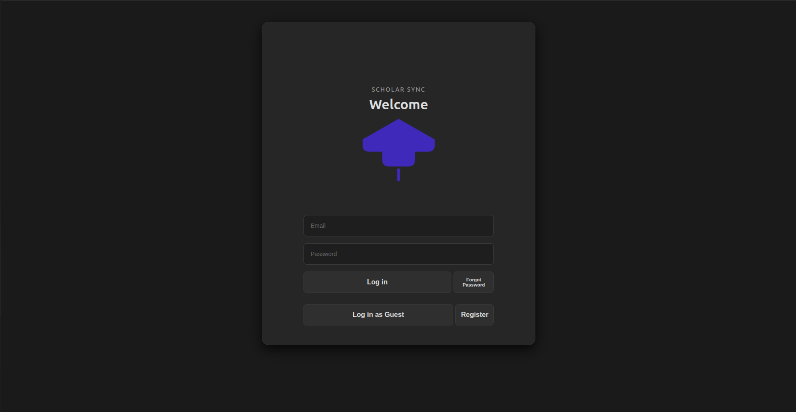
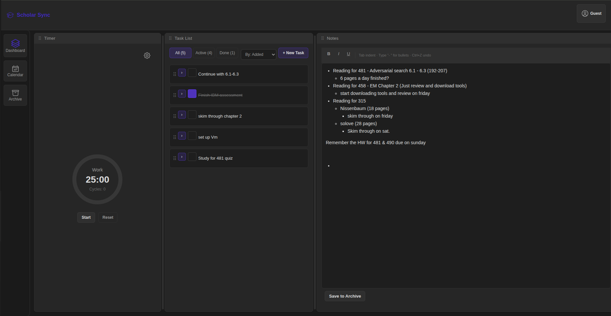
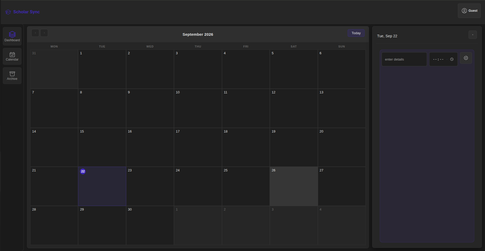
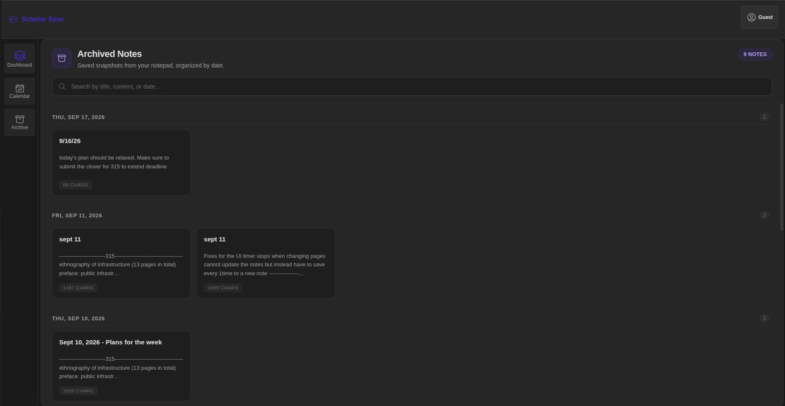
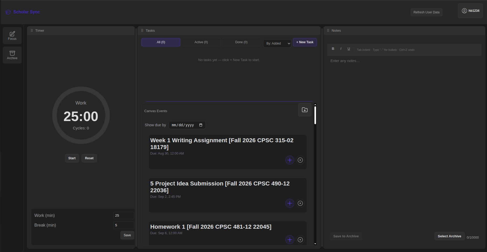

# ScholarSync

ScholarSync is a study-planning web application with two experiences:

- A guest workspace for trying task planning, a Pomodoro-style timer, a rich-text notepad, note archiving, and a calendar without an account.
- An authenticated workspace that adds database-backed tasks, notes, Canvas calendar events, and archived notes.

The project is a local-development full-stack application. The frontend currently calls the backend at `http://localhost:8080` and is configured for a Vite development server at `http://localhost:5173`.

## Features

### Guest experience

- Guest dashboard containing Task List, Timer, and Notes panels.
- Drag-and-drop panel reordering and resizable panels.
- Local task storage, including descriptions, priorities, completion state, progress units, and subtasks.
- Configurable work and break timer with start, pause, reset, cycle counting, alert sound, and persisted timer state.
- Lexical rich-text notepad with list shortcuts and local persistence.
- Standalone monthly calendar with locally stored day entries.
- Local archived notes with titles and content.

Guest data is stored in the browser's `localStorage`; it is not sent to or stored by the backend.

### Authenticated experience

- Registration and login using JWTs.
- Protected `/dashboard` and `/dashboard/archive` routes.
- Database-backed user tasks and task deletion.
- Database-backed notepad content.
- Database-backed archived notes with create, update, list, and delete operations.
- Canvas calendar `.ics` import using a user-provided calendar URL.
- Canvas event refresh, explicit sync-and-override, and per-event deletion.
- Refreshable user context containing the display name, tasks, notepad, and Canvas events.
- The same configurable task, timer, and notes dashboard layout as the guest workspace.

## Technical stack

### Frontend

- React 19
- Vite 7
- React Router 7
- Lexical 0.50 for the rich-text editor
- Browser Fetch API for backend requests
- React Context API for authentication and authenticated user data
- ESLint 9

### Backend

- Java 21
- Spring Boot `4.1.0-SNAPSHOT`
- Spring Web MVC and Spring Security
- Spring Data JPA
- PostgreSQL
- JJWT 0.11.5 for HS256 JWT creation and validation
- ical4j 4.2.4 for parsing iCalendar (`.ics`) data
- Jakarta Bean Validation
- Lombok
- Maven Wrapper

## Repository layout

```text
backend/
  src/main/java/com/ScholarSync/backend/
    authentication_module/  Registration, login, JWT, and security configuration
    global_context_module/ Authenticated user context, tasks, notepad, and archives
    model_module/          JPA entities and repositories
    parser_module/         Canvas URL fetching, iCalendar parsing, and event sync
  src/main/resources/
    application.properties Database and JWT configuration

frontEnd/studentDashboard_frontEnd/
  src/
    components/auth/                 Login and registration
    components/context/              Auth and user-data contexts
    components/dashboard/            Authenticated dashboard
    components/guest-component/      Guest dashboard, calendar, timer, notes, and tasks
    components/user-component/       Authenticated tasks, sidebar, and archive views
    components/protected-route/      Client-side route guard
  package.json
```

## Architecture

### Frontend

`App.jsx` composes `AuthProvider`, `UserProvider`, and React Router. The route guard checks the locally stored JWT before rendering authenticated routes. `UserProvider` loads the signed-in user's aggregate context from the backend.

The authenticated dashboard and guest dashboard share the task, timer, and notes concepts, but use different persistence paths:

- Guest tasks, notes, timer state, calendar entries, panel order, and panel widths use `localStorage`.
- Authenticated tasks, the main notepad, Canvas events, and archived notes use the backend. Dashboard panel order and widths remain local browser preferences.

### Backend

The backend is organized by feature modules and uses a controller/service/repository structure:

```text
HTTP controller
    -> feature service
        -> JPA repository and/or external calendar client
            -> PostgreSQL
```

- `authentication_module` issues JWTs and installs a stateless JWT filter.
- `global_context_module` aggregates user data and manages tasks, notepad content, and archived notes.
- `model_module` contains the `User`, `UserTask`, `CanvasEvent`, and `ArchivedNote` entities and their repositories.
- `parser_module` fetches and parses remote `.ics` calendars, associates events with a user, and reconciles them by external ID or event content.

Spring Security permits `/auth/**` and `/error`. Other application routes require authentication, CORS is configured for `http://localhost:5173`, CSRF is disabled for the stateless API, and the JWT is expected in the `Authorization` header.

## Local setup

### Requirements

- Node.js and npm
- Java 21
- PostgreSQL

Maven does not need to be installed globally because the backend includes `mvnw` and `mvnw.cmd`.

### 1. Configure PostgreSQL and the backend

Create a PostgreSQL database named `ScholarSync`, or change `spring.datasource.url` in `backend/src/main/resources/application.properties`. Set the datasource username and password to match the local PostgreSQL installation.

The current development configuration uses `spring.jpa.hibernate.ddl-auto=update`, so Hibernate updates the schema from the JPA entities when the application starts. This is not a replacement for migrations in production.

The JWT secret and expiration are also configured in `application.properties`. Replace the development secret with a strong secret before using the application outside local development, and do not commit real credentials.

### 2. Start the backend

From the repository root:

```bash
cd backend
./mvnw spring-boot:run
```

On Windows:

```bat
mvnw.cmd spring-boot:run
```

The API listens on `http://localhost:8080` by default.

### 3. Start the frontend

In a second terminal:

```bash
cd frontEnd/studentDashboard_frontEnd
npm install
npm run dev
```

Open the Vite URL shown in the terminal, normally `http://localhost:5173`.

### Frontend scripts

```bash
npm run dev      # Start the Vite development server
npm run build    # Create a production build
npm run lint     # Run ESLint
npm run preview  # Preview the production build
```

## API endpoints

Authentication endpoints return a JWT token:

| Method | Endpoint | Purpose |
|---|---|---|
| `POST` | `/auth/register` | Create an account and return a token |
| `POST` | `/auth/login` | Authenticate an account and return a token |

Authenticated user-context endpoints:

| Method | Endpoint | Purpose |
|---|---|---|
| `GET` | `/api/context/load` | Load the user's name, Canvas events, tasks, and notepad |
| `POST` | `/api/context/save-user-tasks` | Reconcile the user's task list with the database |
| `DELETE` | `/api/context/delete-user-task` | Delete one task belonging to the current user |
| `POST` | `/api/context/save-notepad` | Save the user's notepad text |
| `GET` | `/api/context/archived-notes` | List the user's archived notes |
| `POST` | `/api/context/archived-notes` | Create an archived note |
| `PUT` | `/api/context/archived-notes/{id}` | Update an archived note |
| `DELETE` | `/api/context/archived-notes/{id}` | Delete an archived note |

Canvas event endpoints:

| Method | Endpoint | Purpose |
|---|---|---|
| `POST` | `/api/canvas-events/sync` | Fetch and sync events from a supplied `.ics` URL |
| `POST` | `/api/canvas-events/sync-and-override` | Run the explicit sync-and-override flow using a supplied `.ics` URL |
| `POST` | `/api/canvas-events/refresh` | Re-sync using the user's previously saved calendar URL |
| `DELETE` | `/api/canvas-events/{eventId}` | Delete one Canvas event belonging to the current user |
| `GET` | `/api/canvas-events/test` | Return a simple backend test response |

For protected requests, send:

```text
Authorization: Bearer <jwt-token>
```

## Current limitations

- The frontend and backend URLs are hard-coded for local development.
- Canvas integration uses a user-provided public `.ics` URL; it is not a Canvas OAuth integration.
- Guest data is browser-local and is not associated with an account.
- There are no database migrations, production deployment configuration, roles, or CI/CD workflows in the repository.
- The current backend configuration contains development-oriented datasource and JWT settings that must be replaced for deployment.

## Screenshots






