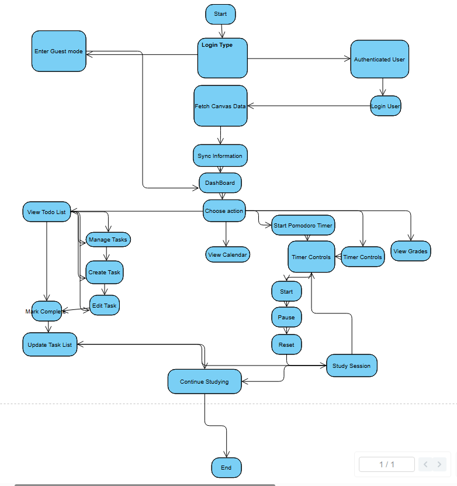

# Activity Diagram

This is the Activity Diagram for Scholar Sync which shows how the user interacts with it. The user will start with a choice on if they want to enter guest mode or log on as an authenticated user. When logged into authenticated user the system will get the canvas data from the token api and sync the information before arriving to the dashboard. On the dashboard the user can make the choice of viewing their todo list, viewing the calendar, checking grades or starting the study timer. The timer leads to the study session when activiated and after completing the task, the user can continue on another task or end the session overall.
