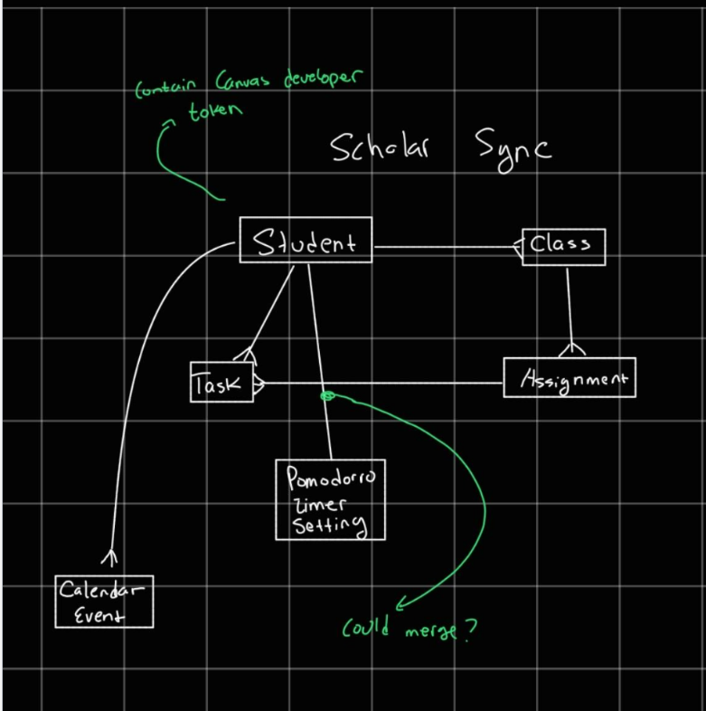

# ER Diagram

This diagram shows the core structure of Scholar Sync. The Student is the central entity connected to Class, Task, Pomodoro Timer, and Calendar Event. The Canvas developer token enables synchronization of student data across all entities.
