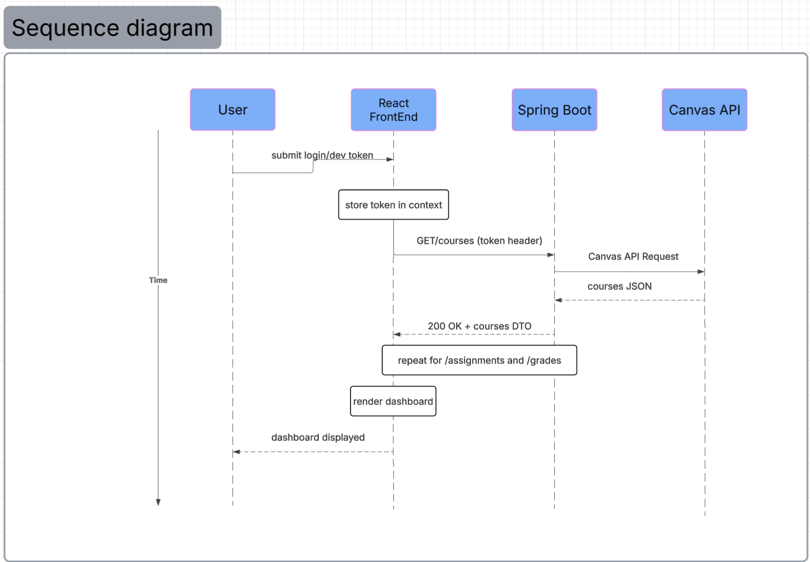

# Sequence Diagram

This Sequence Diagram shows how the data works when the user logs in and loads their dashboard. The user submits a login or developer token to the react front end and stores it. The front end then sends the request to the spring boot backend to obtain the course data. The backend calls the Canvas token API and gets the course data and sends it back to the front end to be displayed. This happens for assignments and grades and updates information as needed. 
